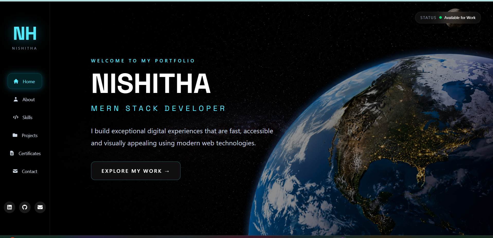
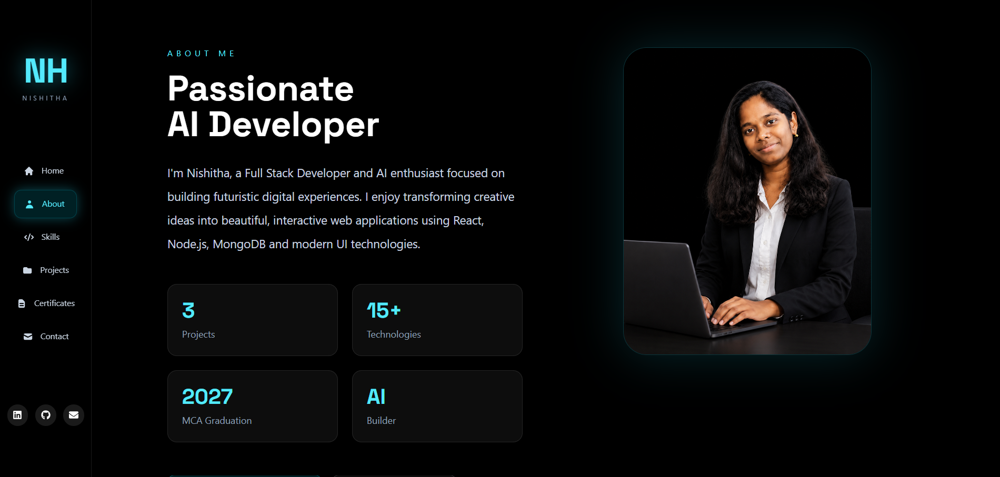
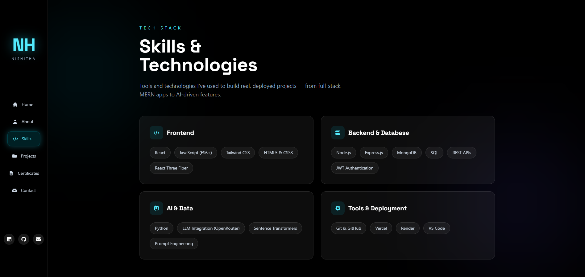
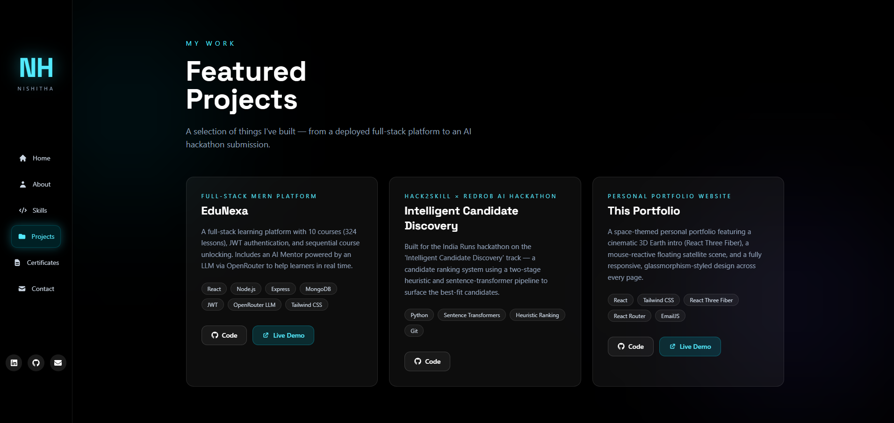
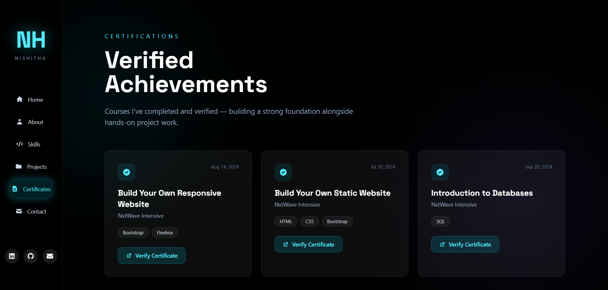
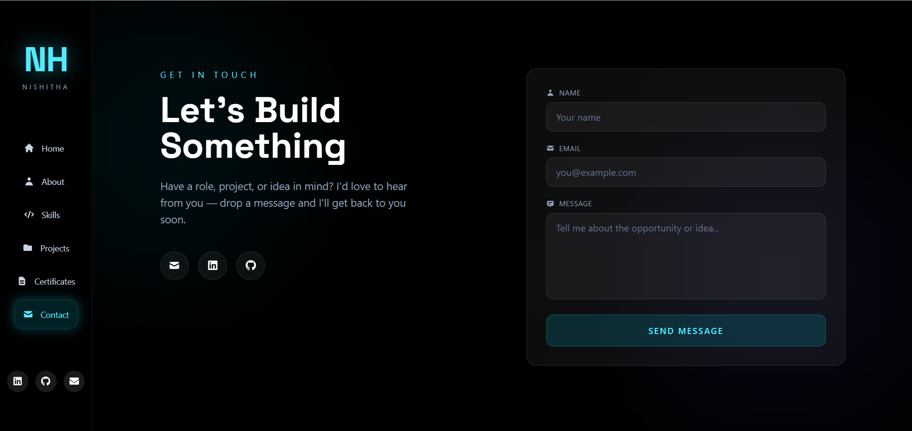

# Nishitha Dheekollu — Portfolio

A fully responsive personal portfolio website with an immersive space theme — featuring a cinematic 3D animated Earth intro, a mouse-reactive floating satellite scene, and smooth page-to-page navigation.

**Live Demo:** [nishitha-portfolio-mu.vercel.app](https://nishitha-portfolio-mu.vercel.app/)

---

## ✨ Features

- **Cinematic Intro** — Animated intro sequence with a rotating 3D Earth (React Three Fiber), eased camera zoom, and smooth fade transition into the site.
- **Interactive Home Page** — Typewriter-style role rotator (Full Stack Developer / MERN Stack Developer / AI Enthusiast, etc.) and a mouse-reactive floating satellite scene.
- **About** — Profile, bio, quick stats, and a "What I Do" breakdown.
- **Skills** — Categorized tech stack (Frontend, Backend & Database, AI & Data, Tools & Deployment).
- **Projects** — Showcases 3 real, deployed works — including this portfolio itself — with GitHub and live demo links.
- **Certificates** — Verified course completions with direct verification links.
- **Contact** — Working contact form powered by EmailJS, plus direct social links.
- **Fully Responsive** — Optimized layouts for mobile, tablet, and desktop, including a hamburger-menu navigation drawer on smaller screens.
- **Consistent Design System** — Dark, glassmorphism UI with cyan accent glow throughout every page.

---

## 📸 Screenshots

| Home | About |
|---|---|
|  |  |

| Skills | Projects |
|---|---|
|  |  |

| Certificates | Contact |
|---|---|
|  |  |

---

## 🛠️ Tech Stack

| Category | Tools |
|---|---|
| Frontend | React, React Router DOM, Tailwind CSS |
| 3D / Animation | React Three Fiber, Three.js |
| Forms / Email | EmailJS |
| Icons | react-icons |
| Build Tool | Vite |

---

## 📂 Project Structure

```
src/
├── pages/                # Route-level pages (Home, About, Skills, Projects, Certificates, Contact, Intro)
├── components/
│   ├── home/              # Sidebar, HeroContent, FloatingScene, RoleRotator
│   ├── introduction/       # Earth, Clouds, SatelliteRing, CameraAnimation, IntroText, FadeTransition
│   ├── about/              # ProfileImage, AboutCard, AboutStats, AboutCTA, WhatIDo
│   ├── skills/              # SkillsHero
│   ├── projects/            # ProjectsHero, ProjectsCard
│   ├── certificates/         # CertificatesHero, CertificateCard
│   └── contact/               # ContactHero
├── styles/                # Global CSS, theme variables, typography, animations
└── AppRoutes.jsx           # Route definitions
```

---

## 🚀 Getting Started

Clone the repository and install dependencies:

```bash
git clone https://github.com/nishi123-dheekollu/Nishitha-Portfolio.git
cd Nishitha-Portfolio
npm install
```

Run the development server:

```bash
npm run dev
```

Open [http://localhost:5173](http://localhost:5173) to view it in the browser.

### Environment Setup

This project uses [EmailJS](https://www.emailjs.com/) for the contact form. Create a free account and update the following in `src/components/contact/ContactHero.jsx`:

```javascript
const SERVICE_ID = "your_service_id";
const TEMPLATE_ID = "your_template_id";
const PUBLIC_KEY = "your_public_key";
```

---

## 📄 Resume

The "Download Resume" button on the About page expects a `resume.pdf` file placed in the `public/` folder.

---

## 📬 Contact

- **Email:** nishithadheekollu111@gmail.com
- **LinkedIn:** [linkedin.com/in/nishitha-dheekollu](https://www.linkedin.com/in/nishitha-dheekollu)
- **GitHub:** [github.com/nishi123-dheekollu](https://github.com/nishi123-dheekollu)

---

## 📝 License

This project is open source and available for reference. Please don't copy the content/resume as your own.